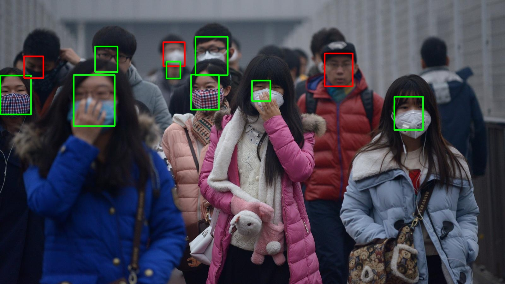

# DataScienceCapstoneDesign2020
# 딥러닝을 활용한 마스크 착용 여부 감지

* 2020-2 데이터분석캡스톤디자인 
* [김영웅 (응용수학과)](https://khero97.tistory.com/)

---


## Project Overview

 * 현재 코로나바이러스(COVID-19)로 인해 음식점 및 카페, 공연시설 등에 출입 시 마스크 착용이 의무화됐다. 출입자의 방문 기록이나 체온 등은 사람 없이도 쉽게 확인할 수 있지만 대부분의 시설에서 마스크 착용 유무는 사람이 직접 확인하고 있다. 이에 자동으로 출입자의 마스크 착용 여부를 감지할 수 있는 모델을 만들어 사람이 일일이 확인할 필요가 없게 만들고자 한다.
 
 </br>

 * 또한 시설 출입 시에는 마스크를 착용했더라도, 시설이용 도중에 마스크를 벗는 경우가 존재한다. 하지만 이를 사람이 계속해서 확인하는 방법은 효율적이지 않고 실제로 그렇게 하기는 힘들다. 따라서 출입 이후에도, 마스크를 벗는 사람을 감지할 수 있는 장치도 필요성이 있다고 판단했다.


---

## Classification Model 


#### Overview
* 마스크를 쓴 사람과 마스크를 쓰지 않은 사람의 얼굴을 Classification 하기 위한 모델을 구현하기 위해서 기존에 구현된 Resnet101 분류기를 사용한다. Resnet101 분류기를 전이 학습 시켜서 마스크를 쓴 사람과 쓰지 않은 사람을 분류할 수 있도록 하였다.

<br>

#### Step1: Data Preparation

* 데이터는 Kaggle에서 다운받을 수 있는 데이터셋을 사용하였으며, 추가로 크롤링을 통한 공개 데이터를 사용하였다. https://www.kaggle.com/andrewmvd/face-mask-detection

<br>

* 데이터 Augmentation을 통해 최종적으로 약 1만개의 데이터를 만들었으며, 마스크를 쓴 사람의 얼굴과 마스크를 쓰지 않은 사람의 얼굴을 약 1:1의 비율로 구성했다.

<br>

#### Step2: Training (Transfer Learning)

* 전이학습은 tensorflow2.0의 케라스(keras) 라이브러리를 사용하였다. 케라스에서 제공하는 ResNet101V2를 베이스 모델로 하였으며, 기존 분류 계층을 제외하고 기존 레이어들을 동결한 뒤, 새 분류 계층을 추가해 학습시켰다.  

```
import ...

PATH = '../Data/faces/'
CATEGORIES = ["masked", "no_masked"]
SIZE = 150
IMG_SHAPE = (SIZE, SIZE, 3)

# Fix random seed
tf.random.set_seed(100)

# 데이터 불러오기
X_train, X_test, Y_train, Y_test = get_data(SIZE)

# ResNet101V2 모델 불러오기
base_model = tf.keras.applications.ResNet101V2(include_top=False, weights='imagenet', input_shape=IMG_SHAPE)

# 베이스 모델 레이어 동결
base_model.trainable = False

# 새 분류 계층 넣기
inputs = tf.keras.Input(shape=IMG_SHAPE)
x = base_model(inputs, training=False)
x = tf.keras.layers.GlobalAveragePooling2D()(x)
x = tf.keras.layers.Dense(64, activation='relu')(x)
outputs = tf.keras.layers.Dense(1)(x)
model = tf.keras.Model(inputs, outputs)

# 콜백 함수 정의
callback_list = [
    tf.keras.callbacks.ModelCheckpoint(  # 에포크마다 현재 가중치를 저장
        filepath="save_file/model_weight.h5",  # 모델 파일 경로
        monitor='accuracy',  # val_loss 가 좋아지지 않으면 모델 파일을 덮어쓰지 않음
        save_best_only=True
    )
]

# 학습 설정 (compile)
base_learing_rate = 0.0001
model.compile(optimizer=tf.keras.optimizers.RMSprop(lr=base_learing_rate),
              loss=tf.keras.losses.BinaryCrossentropy(from_logits=False),
              metrics=['accuracy'])

# 학습
epochs = 50
batch_size = 128
history = model.fit(X_train, Y_train, epochs=epochs, callbacks=callback_list,
                    batch_size=batch_size, validation_split=0.33, shuffle=True)

#
loss, acc = model.evaluate(X_test, Y_test, verbose=0)
print('\nTesting loss: {}, acc: {}\n'.format(loss, acc))

# 학습결과 시각화
plt.plot(history.history['accuracy'])
plt.plot(history.history['val_accuracy'])
plt.title('model accuracy' + str(SIZE))

plt.ylabel('accuracy')
plt.xlabel('epoch')
plt.legend(['train', 'val'], loc='upper left')
plt.show()
```

<br>

####Step3: Test

**(테스트 셋 정확도: 약 97%)**
  


---


## Face Detection Model

#### Overview

* 마스크를 쓴 사람의 얼굴인지 마스크를 쓰지 않은 사람의 얼굴인지 판단하기 전에 먼저 영상 또는 사진에서 사람의 얼굴을 찾아야했으므로, face detection model 이용하고자 하였다. 이 경우 기존에 API 형태로 구현된 모델들이 많이 존재하며, 성능도 뛰어나다. 그 중 내가 선택한 모델은 MTCNN 모델이며, 작은 얼굴들까지 잘 검출하는 특징을 가지고 있다. 


>MTCNN 모델은 Face detection, Bounding box regression, Face alignment 세 가지 테스크를 동시에 학습시키는 joint learning 방식을 사용하였으며, 이를 통해 더 빠른 속도와 높은 정확도를 달성하였다.

<br>

* 현재 MTCNN 모델은 API형태로 배포되어 Python 환경에서 쉽게 사용할 수 있다. 실제 위의 Classification 모델과 함께 테스트해 본 결과는 다음과 같다.



* MTCNN은 마스크를 쓰지 않은 사람들의 데이터를 주로 사용하여 훈련시킨 모델이므로, 마스크를 쓴 사람의 얼굴을 찾아내는데에는 비효율적인 면이 있을 것이라 판단했다. 이를 확인하기 위해서 총 926개의 얼굴을 대상으로 테스트한 결과는 다음과 같았다. 사람의 얼굴이라고 예측한 bounding box 중 65%가 실제 사람의 얼굴이었다. 또한, 나머지 369개의 얼굴은 찾아내지 못했다. 얼굴 검출에 의의를 두어 IoU의 Threshold 값을 0.3으로 둔 것을 생각하면 좋은 성능이라고 판단할 수는 없는 수치였다.

|    True-Positive    |   False-Positive | Precision |
|:------------:|:----------------:|:-----------------:|
|557|299|0.65|

<br>

* 이번 프로젝트에서는 이를 개선하고자, 마스크를 쓴 사람의 이미지를 통해 MTCNN 모델을 재학습시키고자 하였다. 그러나 기존의 학습 방법처럼, Face Alignment를 동시에 학습시키기에는 코와 입이 가려진 사람의 얼굴을 대상으로 적절하지 않은 방법이라고 판단하였고, Classification과 Bounding box regression만 추가 학습시키기로 했다.

<br>

#### Step1: Data Preparation

* 데이터는 Classification model을 학습시킬 때 사용하였던 데이터를 일부 활용하였다. 마스크를 쓴 사람의 얼굴이 포함된 약 2000장에 직접 bounding box를 그리고 이를 좌우 반전 시켜 총 약 4000장의 데이터를 만들었다. 여기에 마스크를 쓰지 않은 사람의 얼굴을 동시에 학습시키기 위해 기존 MTCNN 학습에 사용된 데이터인 WIDER_TRAIN 데이터를 약 5000장 추가로 사용했다.
<br>

#### Step2: Training 

* 모델 학습은 깃허브 레포지토리(https://github.com/wangbm/MTCNN-Tensorflow)의 코드를 참고하였으며, P-net, R-net, O-net을 각각 200 epoch, 300 epoch, 200 epoch씩 학습시켰다.

<br>

* MTCNN 논문에서 고안된 online hard sample mining을 이용하였으며 
<br>

#### Step3: Test

* loss의 경우 P-net의 경우에만 classification loss가 0.1 이하로 내려가지 않는 현상이 있었고 나머지 네트워크의 경우 classification loss와 bounding box regression loss가 0.005 이하까지 줄어들었다.

<br>

* 하지만 최종 학습된 모델을 이용해 기존 MTCNN 모델을 테스트 할 때와 똑같이 테스트하였으나, 훨씬 저조한 결과가 나옴.

|    True-Positive    |   False-Positive | Precision |
|:------------:|:----------------:|:-----------------:|
|374 |229 |0.62|
<br>

---